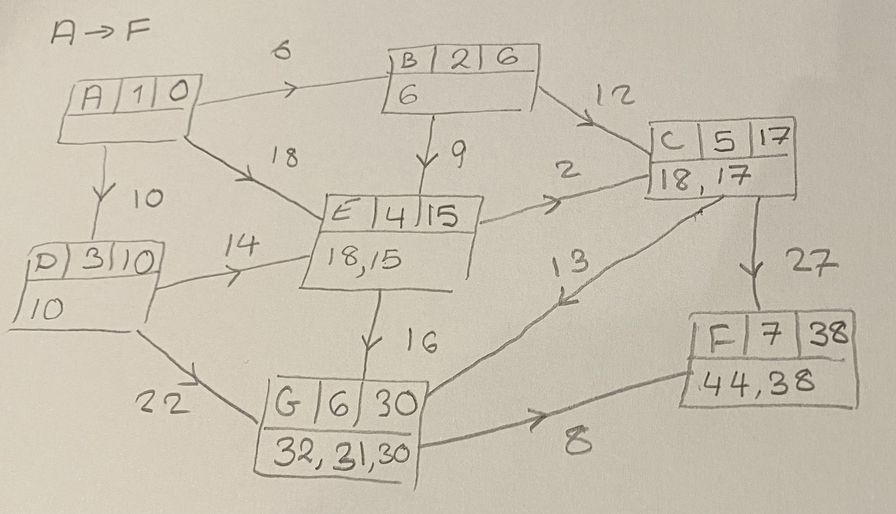

# Dijkstras algorithm

## Introduction
In order to completed this task I will be implementing Dijkstras algorithm. The following document talks through the steps I took to create this solution and my reasoning at different steps of the process.

## Quick Start
The only module I have used which requires install is `pip install numpy`.
All other modules used are inbuilt.

## Exploring the algorithm
I initially started with a simple example which I could easily compute by hand to allow me to check my code as I built it. This also helped me to formulate an idea of how I wanted to go about coding the algorithm and getting an idea for the information I would need to store.

Question taken from the Edexcel D1 A Level Further Maths textbook
(ISBN 978-1-292-18329-9 Exercise 3D Q3)

The network includes node names and path weights.
The algorithm records node names, order of finalising, final distance and working values.
For the purpose of coding, order is unnecessary and working values can be a single updating value.

Required network information: starting/ending node and weight of path
Required method information: node name, working value and final distance.  

## Considering input
The input file type is .dat with data in the following layout: start, end, weight.
For initial testing I have written the example from above into this format.
I will look to convert this into a nested dictionary of the following form:
`{'start1':{'end1':weight}}`
I have assumed going forward that the file fed in will be of this form as outlined in the task documentation and as a result I have not checked this.

## Required imports/modules
I have tried to keep this as minimal as possible, but I will be using;

`numpy` for numerical calculations and to aid in importing the data;

`sys` to satisfy the requirement of this being run form the command line with variables;

`time` to check runtime and ensure it is under 1 second (although I will aim for much lower).

## Import of data
First I created a virtual environment to work in and ran `pip install numpy`.
My first code took in data and created and printed a nested dictionary:
`{'G': {'F': '8'}, 'E': {'G': '16', 'C': '2'}, 'F': {}, 'B': {'E': '9', 'C': '12'}, 'A': {'B': '6', 'D': '10', 'E': '18'}, 'D': {'E': '14', 'G': '22'}, 'C': {'G': '13', 'F': '27'}}`

## The Algorithm
At each step we only consider unvisited nodes as potentials, so I will keep these in a dictionary. I will need to remove nodes as they are visited, so I will create another version to track the solution/final distances.
As I will need to compare any new distance to the previously stored distance, I will calculate the total weight of the network to act as a large initial value to act as a place holder. I did this during the import start to avoid having to loop through the nested dictionary.

## Add Path finding
As each node is finalised I can recorded its previous node, as at this point the path to that point is fixed. I will record this in a dictionary.

## Functions
Now that I have checked it runs, I have divided into two functions to help with testing process.

## Add commandline input to run
Simple line inside of `_name__ == '__main__'` as I will not need this to run if run in another file.

## Initial speed check
While fairly confident my code ran well within the 1 second limit, I wanted to quickly check this. I wrote a separate file to call the two functions and check time taken, including iterating through all combinations of start and end node and taking into account print time. On my computer (while times varied between runs) total time always finished in less than 0.03 seconds. As I was now happy with this, I moved on to the more formal unittesting.

## Unittesting
### Functional Testing
As this is quite a short piece of code with minimal outputs/information returned testing possibilities are limited, in particular for the algorithm itself as it only returns a list object once algorithm is complete. Use of a class object could have potentially provided more opportunity to store and check variables, but this seemed unnecessarily complicated for this task and piece of code.
Much like when I checked the speed, I will iterate through all options for start and end node.
### Speed Testing
As runtime was included in the list of requirements I will check this here too. While writing up the speed check I ran into the problem that the setUp and tearDown methods would have been useful to start and stop my timer, however these do not run for subTests. The use of a subTest was useful to allow iteration and record how many failures took place.
On my computer I found I could drop the allowed_time to around 0.02 before getting any failures (as predicted by my initial speed checks).

**WARNING:** This takes around 15s to fully run due to amount of iteration and printing. For this reason I have #'s out line 73 and 74 which contain the print lines just to help runtime of the test file, although for a fully accurate account of runtime these would need to be considered.

## Next Steps
If I had more time, I would want to add more to my unittesting with a particular focus on what might 'break' my code. For example checking how it would handle errors in the data file as currently I have not included any exception handling due to time restrains. 
